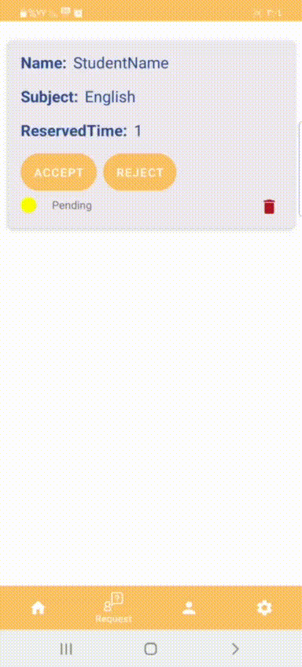

# private-teacher

This is my final graduation project from Tuwaiq Academy, Tuwaiq 1000 program. 
Description :scroll:
The idea of the application is to book private lesson from teachers who offer their services. So, the application have two users the student and teacher.
--
Motivation and Context :
Libraries and technologies used:
Technology (Libraries dependency):
Firebase for authorization
Firestore for storing teacher, student and request information
work manger for notification
App Media :android
# 📸 Screenshots
 
 
  

