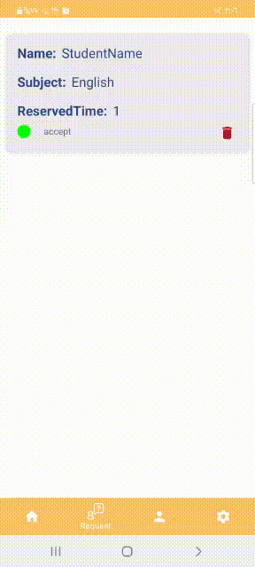

# private-teacher :

This is my final graduation project from Tuwaiq Academy, Tuwaiq 1000 program.

# Description :
The idea of the application is to book private lesson from teachers who offer their services. So, the application have two users the student and teacher.

# Motivation and Context :
Libraries and technologies used:
Technology (Libraries dependency):
- Firebase for authorization
- Firestore for storing teacher, student and request information
- work manger for notification

# Demo Accounts :
- Student Account :
(Email: asdfg@gmail.com, Password: 123456)
- Teacher Account :
(Email: qwerr@gmail.com, Password: 123456)

# 📸 Screenshots

### Student request
 
 
### Teacher request
  

